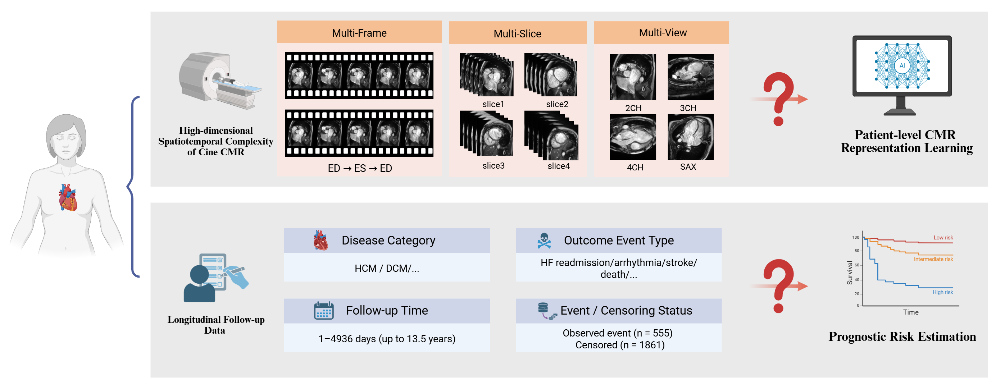
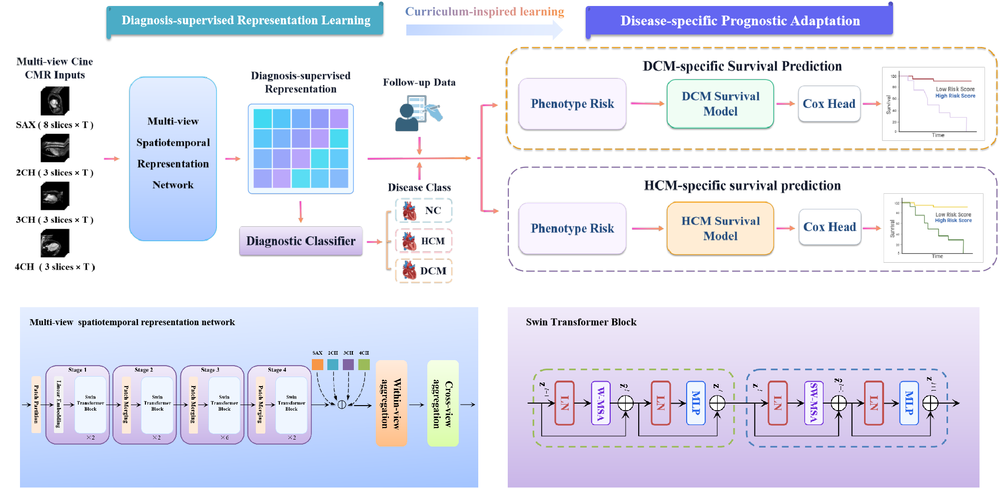

# Spatiotemporal Representation Fusion-based Progressive Diagnosis-to-Prognosis Curriculum Learning for Disease-Specific Survival Prediction from Multi-View Cine CMR


A spatiotemporal representation fusion framework with curriculum-inspired progressive diagnosis-to-prognosis learning for disease-specific survival prediction from real-world multiview cine CMR. 

The framework comprises two consecutive stages. The framework first learns diagnostic representations for normal control (NC), hypertrophic cardiomyopathy (HCM), and dilated cardiomyopathy (DCM), and then transfers the diagnostic representations to HCM- and DCM-specific survival prediction.

#### The motivation:




#### The training algorithm:



## Installation

```bash
conda create -n cine-cmr python=3.10 -y
conda activate cine-cmr
pip install -r requirements.txt
```

Install the PyTorch build matching your CUDA environment before running GPU experiments.

## Usage

Diagnosis:

```bash
python final_diagnosis_code/backbone_baseline_with_r3d18.py \
  --data_path /path/to/cmr_data \
  --weights_path /path/to/swin3d_weights.pth
```

Prognosis:

```bash
python final_prognosis_code/final_prognosis_pipeline.py
```

Please update the dataset, survival table, pretrained weights, diagnostic checkpoint, split, and segmentation model paths before running the code.

## Data and weights

Patient data, clinical outcomes, pretrained weights, feature caches, and trained checkpoints are not included in this repository because of privacy and file-size restrictions.

## Citation

Citation information will be added after publication.

